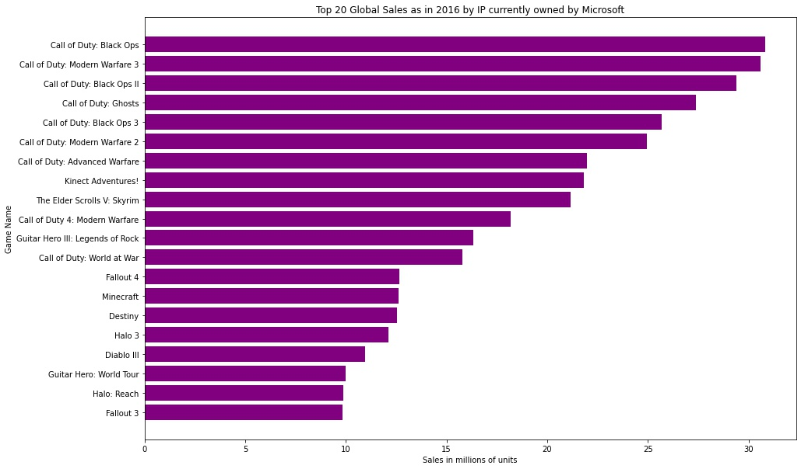

# Microsoft Goes to the Movies
Data driven recommendations for Microsoft's new movie making venture
 
 
Authors:
- Luke Dowker
- Saad Saeed
- Kyle Weesner
 
## Overview
This project analyzes current box office and movie trends to make recommendations to Microsoft Corporation. Namely:

    - Why should Microsoft get into the movie making space?
    - What movie genres are currently performing well and should be focused on? Both with the regular movie going audience as well as critics.
    - What can Microsoft bring to the table that other companies cannot?
 
The first two questions can generally be answered by looking at different movie trends in the last few years. The latter would require delving into Microsoft's unique position in the space and leveraging their list of growing IPs
 
## Business Problem
Having seen the commercial and critical success enjoyed by companies like Netflix, Amazon, Apple, and HBO, prominent stakeholders at Microsoft have decided to launch a film/television studio. However, they have no clue as to *what kind* of movies they should be making in order to be competitive. We will need to analyze various datasets to provide evidence-based recommendations for Microsoft’s 
 
## Data
To generate revenue based trends and data we used data from *www.the-numbers.com* which provides detailed movie financial analysis, including box office, DVD and Blu-ray sales reports, and release schedules. We will be focusing primarily on box office earnings to comment on industry trends.
 
This report also utilizes *www.imdb.com* and *rottentomatoes.com*. Both websites are run off of user interaction and user generated content regarding different movies. The former being an indicator of popularity of various titles using a review and rating system, and the latter being a review aggregator as posted by critics. We shall employ these sites to see what genres are popular by both regular viewers and critics.
 
Webscraping was used to get a list of Microsoft acquisitions so far. Microsoft has been on an acquisition spree in the last few years especially in the video games sector. This makes Microsoft uniquely positioned to leverage IPs that they hold to make original content or maybe even licensing.
In conjunction with this we shall cross reference a sales dataset to see what video game IPs Microsoft owns that are popular and make direct video game adaptation recommendations.
 
## Tools
This report utilizes pandas and sql as our primary data tools to analyse datas as well as visualizations. Webscraping was used to scrape data from Wikipedia.
 

## Results

### Revenue: the-numbers.com
Analysing the data from *the-numbers.com* we were able to come to a few conclusions:
Going to the movies is on the rise and the appetite for entertainment is only growing.


Organizing box office releases by month of release we can see a few trends come to the forefront. As should be expected audience movie watching habits are not static throughout the year. To give weight to more recent trends, the report looks at data post 2012. Plotting the result for mean monthly box office performance shows that the most popular months for viewing are May, June, July followed closely by Nov, Dec. These coincide with summer vacations and the winter holiday season in the North Americas. To best exploit any movie releases, these should be targeted as prime release windows.


  
### Critical Review: rottentomatoes.com
 
Looking at data from www.rotten-tomatoes.com and grouping by ‘genre’ we can see that certain genres perform better with critics. ‘Top Critics’ is a distinction that rotten tomatoes makes between its users. There is a pretty strong corelation between the two but we went ahead and plotted both of them out. 


We also observed that runtime overall has no strong correlation on movie reception
 
 

### Audience Reception: imdb.com

Ordering the IMDb data by number of user ratings, subsetting the 500 films with the highest number of ratings, then plotting the number of occurrences of each genre in those top 500 allows us to visualize the runaway popularity of action, drama, and adventure films.


### As related to videogame IPs

Using our video game sales dataset and grouping by titles that Microsoft now owns we can see a list of potential candidates that can be adapted on to the silver screen. Here are the top 20 selling game titles globally as of 2016




Looking at the data gathered some more precise recommendations can be made:
-   To appeal to the critcal crowd, Microsoft should leverage its Call of Duty franchise. These games were at one point exclusively World War stories and would be a good fit to tell hard hitting stories, a la, 1917 or Saving Private Ryan
-   Microsoft should leverage its Halo franchise to make SciFi action movie and bring the lore of Master Chief to the silver screen. 
-   Minecraft and Kinect Adventures! would be great candidates for a comedy adventure that can appeal to both adults and children 


## Conclusions
-   Entering movies/video entertainment is profitable, and a massive budget is not necessary for box office success
-   Action/Adventure/Drama movies are consistently popular across 2010-2019, the latter especially with critics. Sci-Fi movies on the rise 2015-2019
-   Acquisition of Activision Blizzard opens the door for unique video game adaptations, e.g. Call of Duty and other properties like (Bethesda’s) Elder Scrolls, Fallout, etc.
 
## Repository Structure
```
├── Jupyter Notebooks  
│       ├── Workspace_Kyle
│       │   └── Data_Exploration_Kyle.ipynb
│       ├── Workspace_Luke
│       │   └── Data_Exploration_Luke.ipynb
│       └── Workspace_Saad
│           ├── Data_Exploration_Saad.ipynb
│           ├── Revenue_dataset.ipynb
│           └── Rotten_Tomatoes_dataset.ipynb
│
├── data
├── images
├── README.md
└── Jupyter_Notebook_Final.ipynb
```
 
### Next Steps
-Explore other Microsoft-owned properties for further film adaptations
Citations:
https://stackoverflow.com/questions/17972938/check-if-a-string-in-a-pandas-dataframe-column-is-in-a-list-of-strings
 
[List of mergers and acquisitions by Microsoft](https://en.wikipedia.org/wiki/List_of_mergers_and_acquisitions_by_Microsoft)
[Xbox Game Studies](https://en.wikipedia.org/wiki/Xbox_Game_Studios)
[Video game sales (Kaggle)](https://www.kaggle.com/coffeepot/videogame-sales/data)
 

